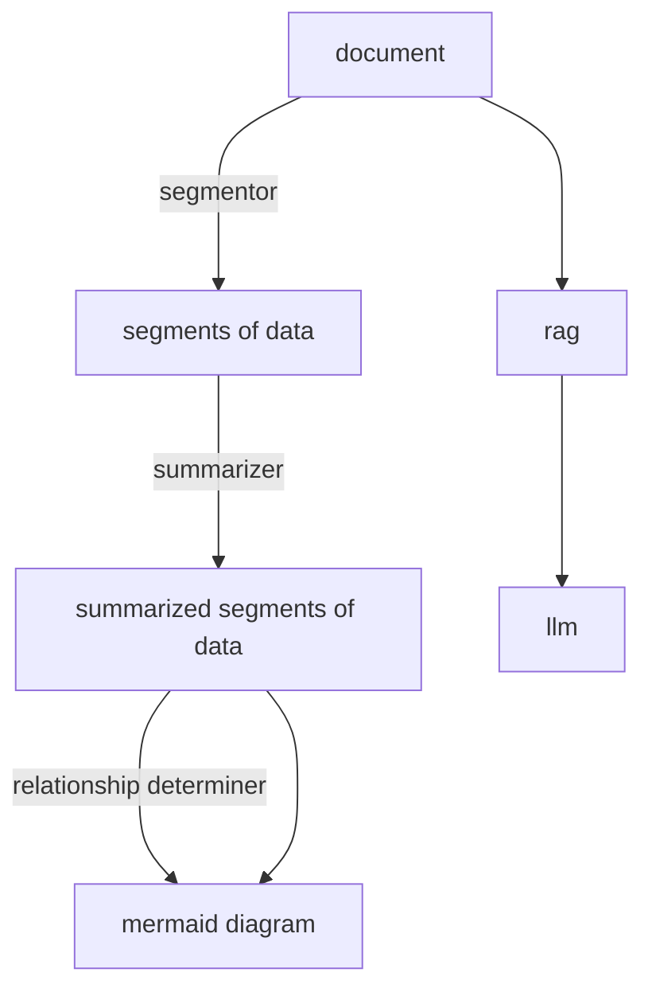

+++
title = "introducing mindpalace"
date = "2025-03-12"
author = "irvin"
cover = "img/paper.jpeg"
coverCaption = "this is the cover caption"
description = "Athis is the desc"
tags=["theme", "light"]
+++

# mapit

the idea: the user should be able to input pdf(s) which get converted into mindmaps for easy learning. the same should be done for github repos. in addition, there should be an llm to ask questions.

useful for neurodiverse people; facilitates better learning for them

inspirations

- 1. docagram
    
    creates flow-chart summaries from web pages
    
    flow:
    
    
    
    - takes in data from web page sections
    - creates a summary of each of those sections
    - generates relationships between parts of the section
    - has 2 versions -
        - w/o gemini: uses summarizer api and prompt api for the 2 tasks respectively
        - w/ gemini
    
    example:
    
    - content:
        
        
        
    - summary:
        
        
        
    - summary v2 (used to generate the graph)
        
        
        
    - graph/mermaid diagram:
        
        
        
        a shaded box displays the relationship, the unfilled boxes are entities
        
    - gemini result
        
        
        
    - also have the ability to display all graphs together, can choose specific entitites to show as well if someone wants to learn topic wise
- 2. https://medium.com/@elle.neal_71064/mind-mapping-with-ai-an-accessible-approach-for-neurodiverse-learners-1a74767359ff

initial plan looks like this (19/02/25):



// want to create it on streamlit since minimal ui, simpler coding

// can deploy on streamlit or vercel (vercel will look more professional)

update 1 (19/2/25):

- i feel like i should pivot this towards github. a tool that facilitates understanding of complex repos through mindmap generation and llm integration
    - for github repo, i need to parse the contents into an llm acceptable format. there are tools doing that already. i am not sure whether to use them/their apis or develop it completely on my own.
    - one of the ideas i came across recently was that of [https://www.entelligence.ai/explore](https://www.entelligence.ai/explore) - they take in repos, integrate an llm, provide documentation and flow diagram.
        - the llm responses are really good - looks finetuned (??)
- maybe have both options - github and documents
    - multimodal support is crucial - it should be able to take in documents, pictures,

the road

- 1. trying out beautiful soup (referring to https://medium.com/@elle.neal_71064/mind-mapping-with-ai-an-accessible-approach-for-neurodiverse-learners-1a74767359ff)
    
    ```bash
    pip install bs4 requests
    // created a venv called mapit
    did pip install bs4 requests again
    ```
    
    python code:
    
    ```python
    import requests
    from bs4 import BeautifulSoup
    
    def scrape_text(url):
        # Send a GET request to the URL
        response = requests.get(url)
    
        # If the GET request is successful, the status code will be 200
        if response.status_code == 200:
            # Get the content of the response
            page_content = response.content
    
            # Create a BeautifulSoup object and specify the parser
            soup = BeautifulSoup(page_content, "html.parser")
    
            # Get the text of the soup object
            text = soup.get_text()
    
            # Return the text
            return text
        else:
            return "Failed to scrape the website"
    
    url=input("enter url:")
    text=scrape_text(url)
    print(text)
    ```
    
    returns text in the website.
    
- 2. implementing this medium article: https://medium.com/@elle.neal_71064/mind-mapping-with-ai-an-accessible-approach-for-neurodiverse-learners-1a74767359ff
    - they’ve given the entire *input_text* received after parsing to the model and asked to generate mermaid maps
    - i want mine to be better - it should generate summaries and mermaids for each section, determine the relation among the sections and generate a cohesive mermaid also
- 3. trying to get mermaid diags via chatgpt
    - asked chatgpt to analyse my repo - via the repo link - and asked to give a mermaid code explaining it
    - output:
        
        ```mermaid
        graph TD
            A[Start] --> B[Load Configuration]
            B --> C[Read Input Data: Orders & Locations]
            C --> D[Fetch Route Data from APIs]
            D --> E[Optimize Routes using Held-Karp Algorithm]
            E --> F[Calculate Emissions Based on Route]
            F --> G[Generate Optimized Route and Emissions Report]
            G --> H[Display Output to User]
            H --> I[End]
            
            %% Dependencies
            D -->|API Calls| J{TomTom API / HERE API}
            J --> D
        ```
        
        the output aint bad
        
    - then i used [gitingest](https://gitingest.com/) to get llm ready parseed version of my repo. gave it as context to gpt4o and asked it to give a mermaid code.
        
        prompt: [llm ready parsed info (token length - 4.7k)] given the above description of a repository, write code for a mermaid diagram explaining the same
        
        - output:
            
            ```mermaid
            graph TD;
                A[Repository: 1rvinn-fedexpedite] -->|Contains| B[README.md]
                A -->|Contains| C[app.py]
                A -->|Contains| D[requirements.txt]
                A -->|Contains| E[images/]
                A -->|Contains| F[.streamlit/]
                F --> G[config.toml]
                
                subgraph "Core Files"
                    B -->|Provides| B1[Project Overview & Setup Instructions]
                    C -->|Main Application| C1[Route Optimiser & Emission Calculator]
                    D -->|Dependencies| D1[Streamlit, Folium, Requests, Streamlit Folium]
                    E -->|Contains| E1[Visual Assets - Screenshots, Diagrams]
                    G -->|Defines| G1[Streamlit Theme & UI Customisation]
                end
            
                subgraph "Application Workflow"
                    C1 -->|Receives API Keys| H[TomTom API, HERE API]
                    C1 -->|Takes Inputs| I[Route Preferences, Vehicle Type, Fuel Type]
                    I -->|Uses| J[Held-Karp Algorithm for Optimisation]
                    J -->|Outputs| K[Optimal Route, Travel Time, Emission Data]
                    K -->|Visualised in| L[Google Maps, Folium Map]
                end
            
            ```
            
        - maybe ask it to give 2 separate diagrams for directory structure and code logic.
            
            prompt: give 2 separate codes - one explaining the directory structure and the other explaining the code, logic and flow
            
            output:
            
            - og output: has errors
                
                ```mermaid
                ```mermaid
                graph TD;
                    %% Directory Structure
                    subgraph "Repository Structure"
                        A[Repository: 1rvinn-fedexpedite] -->|Contains| B[README.md]
                        A -->|Contains| C[app.py]
                        A -->|Contains| D[requirements.txt]
                        A -->|Contains| E[images/]
                        A -->|Contains| F[.streamlit/]
                        F --> G[config.toml]
                    end
                
                    subgraph "Core Files"
                        B -->|Provides| B1[Project Overview & Setup Instructions]
                        C -->|Main Application| C1[Route Optimiser & Emission Calculator]
                        D -->|Dependencies| D1[Streamlit, Folium, Requests, Streamlit Folium]
                        E -->|Contains| E1[Visual Assets (Screenshots, Diagrams)]
                        G -->|Defines| G1[Streamlit Theme & UI Customisation]
                    end
                ```
                
                ```mermaid
                graph TD;
                    %% Application Logic and Flow
                    A[User Input] -->|Enter Route Details| B[Start Location & Stops]
                    B -->|Fetch Coordinates| C[HERE API]
                    B -->|Select Vehicle Type| D[Emission Factors Calculation]
                    
                    subgraph "Route Calculation"
                        C -->|Compute Routes| E[TomTom API]
                        E -->|Applies| F[Held-Karp Algorithm]
                        F -->|Outputs| G[Optimised Route & Travel Time]
                    end
                    
                    subgraph "Emissions Calculation"
                        D -->|Compute Emissions| H[Vehicle Type, Engine Size, Fuel Type]
                        H -->|Uses Data| I[India GHG Emission Factors]
                        I -->|Outputs| J[Total Emissions (kg CO₂)]
                    end
                    
                    subgraph "Visualisation & Results"
                        G -->|Displays| K[Google Maps & Folium]
                        J -->|Shows| L[Emissions Output]
                        K & L -->|Final Output| M[User Dashboard]
                    end
                ```
                
                ```
                
            - output divided into 2
                
                ```mermaid
                
                graph TD;
                    %% Directory Structure
                    subgraph "Repository Structure"
                        A[Repository: 1rvinn-fedexpedite] -->|Contains| B[README.md]
                        A -->|Contains| C[app.py]
                        A -->|Contains| D[requirements.txt]
                        A -->|Contains| E[images/]
                        A -->|Contains| F[.streamlit/]
                        F --> G[config.toml]
                    end
                
                    subgraph "Core Files"
                        B -->|Provides| B1[Project Overview & Setup Instructions]
                        C -->|Main Application| C1[Route Optimiser & Emission Calculator]
                        D -->|Dependencies| D1[Streamlit, Folium, Requests, Streamlit Folium]
                        E -->|Contains| E1[Visual Assets - Screenshots, Diagrams]
                        G -->|Defines| G1[Streamlit Theme & UI Customisation]
                    end
                ```
                
                ^ this is good.
                
                ```mermaid
                graph TD;
                    %% Application Logic and Flow
                    A[User Input] -->|Enter Route Details| B[Start Location & Stops]
                    B -->|Fetch Coordinates| C[HERE API]
                    B -->|Select Vehicle Type| D[Emission Factors Calculation]
                    
                    subgraph "Route Calculation"
                        C -->|Compute Routes| E[TomTom API]
                        E -->|Applies| F[Held-Karp Algorithm]
                        F -->|Outputs| G[Optimised Route & Travel Time]
                    end
                    
                    subgraph "Emissions Calculation"
                        D -->|Compute Emissions| H[Vehicle Type, Engine Size, Fuel Type]
                        H -->|Uses Data| I[India GHG Emission Factors]
                        I -->|Outputs| J[Total Emissions - kg CO₂]
                    end
                    
                    subgraph "Visualisation & Results"
                        G -->|Displays| K[Google Maps & Folium]
                        J -->|Shows| L[Emissions Output]
                        K & L -->|Final Output| M[User Dashboard]
                    end
                ```
                
                ^ this one is really detailed. but i’m sure its taking inputs from the readme file.
                
        - trying without giving the readme file, as the readme already contains the flow.
            
            prompt: [llm ready parsed info (token length - 4.7k)] given the above description of a repository, write code for a mermaid diagram explaining the same. give 2 separate codes - one explaining the directory structure and the other explaining the code, logic and flow
            
            output:
            
            - og output
                
                ```mermaid
                
                ```
                
            - fixed output
                
                ```mermaid
                graph TD
                    A[1rvinn-fedexpedite]
                    A --> B[app.py]
                    A --> C[requirements.txt]
                    A --> D[images/]
                    A --> E[.streamlit/]
                    E --> F[config.toml]
                ```
                
                ```mermaid
                flowchart TD
                    A[Start: Streamlit App Initialization]
                    B[Set page configuration & initialize session state - stops, optimal_route]
                    C[Display App Logo]
                    D[Sidebar: Set Route Calculation Parameters - Traffic, etc.]
                    E[Sidebar: Select Vehicle Details - Travel Mode, Car Type, Engine Size, Fuel Type]
                    F[Sidebar: Choose Input Mode - Coordinates or Search for Destination]
                    G{Input Mode Check}
                    H[Enter Starting Location]
                    I[If Search: Call HERE API to fetch coordinates]
                    J[Add Stop - Coordinates/Search and update session state]
                    K[Optional: Input Ending Location - flexible]
                    L[Display Added Stops with option to Clear]
                    M[Click Calculate Optimal Route]
                    N[For each pair of locations: Call TomTom API to get route details]
                    O[Solve the Traveling Salesman Problem using Held-Karp Algorithm]
                    P[Generate Optimal Route Sequence, Total Distance & Travel Time]
                    Q[Align stop names with the optimal sequence]
                    R[Generate Google Maps URL for the route]
                    S[Calculate Emissions based on vehicle and distance]
                    T[Display Results: Sequence, Total Time, Distance, Emissions]
                    U[Visualize Route on a Folium Map with Markers]
                    V[End]
                
                    A --> B
                    B --> C
                    C --> D
                    D --> E
                    E --> F
                    F --> G
                    G -- "Coordinates" --> H
                    G -- "Search" --> I
                    H --> J
                    I --> J
                    J --> K
                    K --> L
                    L --> M
                    M --> N
                    N --> O
                    O --> P
                    P --> Q
                    Q --> R
                    R --> S
                    S --> T
                    T --> U
                    U --> V
                ```
                
                ^ this is too ass.
                
                asked to redo, gave this:
                
                ```mermaid
                graph TD;
                    A[Start - Streamlit App] -->|Initialize Session| B[Session State Variables]
                    A -->|Load API Keys| C[TomTom & HERE API Keys]
                    A -->|Set Streamlit Config| D[UI Configuration]
                
                    B --> E[Sidebar Input]
                    E -->|User Inputs Start Location| F[Fetch Coordinates via HERE API]
                    E -->|User Inputs Stops| G[Add Stops]
                    E -->|User Selects Vehicle Type| H[Emission Calculation Parameters]
                    E -->|User Clicks Calculate Route| I[Calculate Optimal Route]
                
                    I --> J[Calculate Route using TomTom API]
                    J --> K[Solve TSP for Optimal Path]
                    K --> L[Store Optimal Route in Session State]
                
                    L --> M[Display Results]
                    M -->|Show Route Sequence| N[Show Optimal Stops]
                    M -->|Show Travel Time & Distance| O[Calculate Emissions]
                    M -->|Show Google Maps Link| P[Generate Google Maps URL]
                    M -->|Display Route on Folium Map| Q[Render Map with Start, Stops, and End]
                
                    Q --> R[End - Streamlit App]
                    
                ```
                
                ^ still ass.
                
                ```mermaid
                graph TD;
                    A[Start - Streamlit App] -->|Initialize Session| B[Session State Variables]
                    A -->|Load API Keys| C[TomTom & HERE API Keys]
                    A -->|Set Streamlit Config| D[UI Configuration]
                
                    B --> E[Sidebar Input]
                    E -->|User Inputs Start Location| F[Fetch Coordinates via HERE API]
                    E -->|User Inputs Stops| G[Add Stops]
                    E -->|User Selects Vehicle Type| H[Emission Calculation Parameters]
                    E -->|User Clicks Calculate Route| I[Calculate Optimal Route]
                
                    I --> J[Calculate Route using TomTom API]
                    J --> K[Solve TSP for Optimal Path]
                    K --> L[Store Optimal Route in Session State]
                
                    L --> M[Display Results]
                    M -->|Show Route Sequence| N[Show Optimal Stops]
                    M -->|Show Travel Time & Distance| O[Calculate Emissions]
                    M -->|Show Google Maps Link| P[Generate Google Maps URL]
                    M -->|Display Route on Folium Map| Q[Render Map with Start, Stops, and End]
                
                    Q --> R[End - Streamlit App]
                ```
                
            - the outputs were sub standard despite using a sota model - 4o which has a big context window.
            - when i use an api, the output’s quality is bound to degrade.
            - the token size is also something that should be taken care of; some repos are excessively big and hence really big token sizes which would be hard to handle.
            - therefore, it is of utmost importance to divide the content into sections, provide summaries for each part and then ask the model to create a diagram.
                - testing this hypothesis
            - also, what about rag? - cant use it for
        
        ReactFlow
        
- 4. code to get llm ready parsed github data
    - using requests and base 64, got the following code running that prints the contents of a github repo given its name and the owner’s name. uses github api for it.
        
        ```python
        import requests
        import base64
        
        # GitHub repository details 
        BASE_URL = f"https://api.github.com/repos/{OWNER}/{REPO}/contents"
        
        def fetch_repo_contents(path=""):
            """Recursively fetches all files in the GitHub repository."""
            url = f"{BASE_URL}/{path}" if path else BASE_URL
            headers = {"Authorization": f"token {GITHUB_TOKEN}"} if GITHUB_TOKEN else {}
            
            response = requests.get(url, headers=headers)
            
            if response.status_code == 200:
                return response.json()
            else:
                print(f"Error fetching {url}: {response.status_code}")
                return None
        
        def get_file_content(file_url):
            """Fetches and decodes the content of a file from GitHub."""
            headers = {"Authorization": f"token {GITHUB_TOKEN}"} if GITHUB_TOKEN else {}
            
            response = requests.get(file_url, headers=headers)
            
            if response.status_code == 200:
                file_data = response.json()
                if file_data.get("content"):
                    content = base64.b64decode(file_data["content"]).decode("utf-8", errors="ignore")
                    return content
            else:
                print(f"Error fetching file content: {response.status_code}")
            
            return None
        
        def traverse_repo(path=""):
            """Recursively traverses the GitHub repository and prints file contents."""
            items = fetch_repo_contents(path)
        
            if items:
                for item in items:
                    if item["type"] == "file":
                        print(f"\n📄 File: {item['path']}")
                        content = get_file_content(item["url"])
                        print(f"--- START OF {item['name']} ---")
                        print(content[:1000])  # Print first 1000 chars for preview
                        print(f"--- END OF {item['name']} ---\n")
                    
                    elif item["type"] == "dir":
                        print(f"\n📂 Directory: {item['path']}")
                        traverse_repo(item["path"])  # Recursive call for directories
        
        # Run the script
        print(f"📂 Fetching repository contents for {OWNER}/{REPO}...")
        traverse_repo()
        ```
        
    
    ^ need to make the following changes:
    
    - [x]  need to change this to take in a url
        
        must have ‘https://github.com/’ in the beginning - a possible scope of error
        
    - [x]  currently, it’s also printing image and hidden files/directories’ data, which it should skip
        
        ^ excluded the following extensions:
        
        .png, .jpg, .jpeg, .gif, .svg, .ico, .webp, .pdf, .zip, .tar, .gz, .mp4, .mp3, .avi
        
    - [x]  need it to also print the structure on top
    - [x]  must also print that it has exited a directory
    - issue: github api has a limited no. of requests (60) per hour per ip.
        - one request is used per file/directory accessed
        - how to bypass this!!!!!!!
        - update 10/3/25: lol i just had to pass my github auth token and the no of requests per hour increases from 60 to 5000
    
- divide it into sections (or files); llm provides a technical summary of each section (or file); then these summaries and the structure is fed into the system to analyse the contents and give a mermaid diagram
- can we integrate rag so that it’s able to refer to specifics within the code for a more detailed diagram.
    
    ^ dont really think this is required, since the mermaid diagram is only aimed at providing a high level summary of how the entire code works.
    
- can have mermaid diagrams per section (or file), then one combining them too
- this kind of ui looks really good. plus if the creation could be animated then would look very cool.


- plan (24/2/25):
    - work on segmenter, summarizer, relation determiner and mermaid diag generator first.
    
    ```mermaid
    flowchart 
    A[user input]--->B[pdf]--->|parser - ocr/text extractor|E[segmentor]
    A--->C[text]--->E
    A--->D[url]--->|parser - beautiful soup/selenium|E
    A--->K[github repo]--->|repo parser - graphql or gitingest|C[text]
    E--->|topic-wise segmented text packets|F[summarizer]
    F--->|topic-wise summarized packets|G[relationship determiner]--->H--->I[combined mermaid diag]
    F--->|summarized text per topic|H[mermaid diagram generator]--->J[individual mermaid diagrams]
    ```
    
    random idea but how would an ai model architecture visualizer be?
    
- code for ssrg:
    - iter 1
        - used this code
            
            
            ```python
            import os
            import re
            import google.generativeai as genai
            import json
            
            genai.configure(api_key=os.environ["GEMINI_API_KEY"])
            
            # Create the model
            generation_config = {
              "temperature": 1,
              "top_p": 0.95,
              "top_k": 40,
              "max_output_tokens": 8192,
              "response_mime_type": "text/plain",
            }
            
            def extract_json(text):
                """Extracts valid JSON from Gemini API response."""
                match = re.search(r"\{.*\}", text, re.DOTALL)  # Find JSON inside { ... }
                if match:
                    return match.group(0)  # Return only the JSON part
                return None
            
            def ss(text):
                model1 = genai.GenerativeModel(
                model_name="gemini-2.0-flash",
                generation_config=generation_config,
                system_instruction="You are an AI that extracts key topics from text and summarizes them.\n\n    - Identify the major topics.\n    - Provide a 2-3 sentence summary per topic.\n    - Return results in JSON format:\n    \n    {{\n      \"topics\": [\n        {{\"topic\": \"Topic 1\", \"summary\": \"Summary of topic 1\"}},\n        {{\"topic\": \"Topic 2\", \"summary\": \"Summary of topic 2\"}}\n      ]\n    }} \n**output only JSON in plaintext format, nothing else",
                )
            
                chat_session = model1.start_chat(
                history=[
                ]
                )
                response = chat_session.send_message(text)
            
                return response.text
            
            def relation(summary):
                model2 = genai.GenerativeModel(
                model_name="gemini-2.0-flash",
                generation_config=generation_config,
                system_instruction="You are an AI that identifies relationships between topics.\n\n    Given this JSON data of topics, determine relevant relationships:\n    \n    JSON Data: {segmented_data}\n    \n    Output format:\n    {{\n      \"relationships\": [\n        {{\"from\": \"Topic 1\", \"to\": \"Topic 2\", \"relationship\": \"How they are related\"}},\n        {{\"from\": \"Topic 2\", \"to\": \"Topic 3\", \"relationship\": \"Another connection\"}}\n      ]\n    }} \n**output only JSON, nothing else**",
                )
            
                chat_session = model2.start_chat(
                history=[
                ]
                )
            
                response = chat_session.send_message(summary)
                return response.text
            
            def generate_mermaid_code(topics_json, relationships_json):
                topics = json.loads(topics_json)["topics"]
                relationships = json.loads(relationships_json)["relationships"]
            
                mermaid_code = "graph TD;\n"
            
                # Add topics as nodes
                for i, topic in enumerate(topics):
                    mermaid_code += f'  {chr(65+i)}["{topic["topic"]}"];\n'
            
                # Add relationships as edges
                for relation in relationships:
                    from_topic = relation["from"]
                    to_topic = relation["to"]
                    relation_text = relation["relationship"]
            
                    from_id = next(i for i, t in enumerate(topics) if t["topic"] == from_topic)
                    to_id = next(i for i, t in enumerate(topics) if t["topic"] == to_topic)
            
                    mermaid_code += f'  {chr(65+from_id)} -->|{relation_text}| {chr(65+to_id)};\n'
            
                return mermaid_code
            
            # def generate_mind_map(text):
            #     segmented_data = ss(text)
            #     relationships_data = relation(segmented_data)
            #     mermaid_diagram = generate_mermaid_code(segmented_data, relationships_data)
            
            #     return mermaid_diagram
            
            if __name__ == "__main__":
                input_text = input("input: ")
                
                segmented_data = extract_json(ss(input_text))
                print(f"1: {segmented_data}")
                relationships_data = extract_json(relation(segmented_data))
                print(f"w: {relationships_data}")
                mermaid_diagram = generate_mermaid_code(segmented_data, relationships_data)
            
                print("Generated Mermaid Diagram:\n")
                print(mermaid_diagram)
            ```
            
            input:
            
            ```
            Artificial Intelligence is revolutionizing industries.
            In healthcare, AI assists with diagnostics and personalized treatments.
            In finance, AI helps detect fraud and optimize trading strategies.
            Machine learning models power these applications, improving accuracy.
            ```
            
            output:
            
            ```mermaid
            graph TD;
              A["AI Revolutionizing Industries"];
              B["AI in Healthcare"];
              C["AI in Finance"];
              B -->|AI in Healthcare is a specific application area contributing to the broader AI Revolution across various industries.| A;
              C -->|AI in Finance is a specific application area contributing to the broader AI Revolution across various industries.| A;
              B -->|Both topics represent specific examples of how AI is applied in different sectors to improve efficiency and decision-making through data analysis.| C;
            ```
            
            thoughts:
            
            - it identifies major topics well
            - relationships are mid
            - there is no particular flow to it
        - prompts
            1. summarizer and segmentor
        
        ```mermaid
        graph TD;
          A["Introduction and Applicability"];
          B["General Controls: Governance and Management of Security Risks"];
          A -->|The 'Introduction and Applicability' section sets the scope and effective date for the directions, while the 'General Controls' section outlines the specific governance and management policies that Regulated Entities - REs - must implement to comply with these directions.| B;
        ```
        
    - iter 2: changed the prompts a bit to increase no. of nodes and better connections
        - new prompts
            - segmentor and summarizer:
                
                ```
                Extract as many **short, precise** topics as possible from the given text.
                
                    **Rules:**
                    - Each topic must be **concise (1-3 words max)**.
                    - Aim for **10+ topics** if the content allows.
                    - Summarize each topic in **one short sentence**.
                    - **Strictly return JSON format only.**
                
                    **Example Output:**
                    ```json
                    {{
                      "topics": [
                        {{"topic": "AI in Medicine", "summary": "AI enhances diagnostics and treatment"}},
                        {{"topic": "Fraud Detection", "summary": "AI identifies financial fraud in real-time"}},
                        {{"topic": "Robotics", "summary": "Autonomous robots optimize industrial tasks"}},
                        {{"topic": "Self-Driving Cars", "summary": "AI enables autonomous vehicle navigation"}}
                      ]
                    }}
                    ```
                
                    **Text Input:** {text}
                ```
                
            - relationship determiner
                
                ```
                Identify **diverse** relationships between the given topics.
                
                    **Rules:**
                    - Find as many **relevant connections** as possible.
                    - Use **short, precise** relationship descriptions.
                    - Relationships should not be **too obvious** (avoid generic links).
                    - **Strictly return JSON format only.**
                
                    **Example Output:**
                    ```json
                    {{
                      "relationships": [
                        {{"from": "AI in Medicine", "to": "Machine Learning", "relationship": "Uses ML models"}},
                        {{"from": "Self-Driving Cars", "to": "Computer Vision", "relationship": "Relies on CV for object detection"}},
                        {{"from": "Fraud Detection", "to": "AI in Finance", "relationship": "Prevents financial crimes"}},
                        {{"from": "Robotics", "to": "AI Ethics", "relationship": "Raises ethical concerns"}}
                      ]
                    }}
                    ```
                
                    **Given Topic Data:**  
                    ```json
                    {segmented_data}
                    ```
                
                    **Output only JSON. No extra text.**
                ```
                
        - result
            
            ```mermaid
            graph TD;
              A["Digital Payments"];
              B["Regulatory Framework"];
              C["Effective Date"];
              D["Regulated Entities"];
              E["Definitions"];
              F["Security Risks"];
              G["Board Approval"];
              H["Customer Data"];
              I["System Availability"];
              J["Dispute Resolution"];
              K["Policy Review"];
              L["User Acceptance Tests"];
              M["External Assessment"];
              A -->|Subject to various security threats| F;
              A -->|Governed by legal guidelines| B;
              B -->|Defines the scope of entities covered| D;
              C -->|Determines when the legal framework becomes active| B;
              E -->|Provides clarity to the legal terms used| B;
              F -->|Threats can compromise customer information| H;
              F -->|Can lead to service outages| I;
              G -->|Needed for key decisions related to digital payments| A;
              H -->|May be needed to resolve disputes| J;
              I -->|Critical for reliable digital payment services| A;
              K -->|Ensures alignment with evolving legal standards| B;
              L -->|Validates usability before payment platform launch| A;
              M -->|Identifies vulnerabilities and mitigates risks| F;
              G -->|Required for changes to digital payment policies| K;
              M -->|Ensures security of digital payment systems| A;
              D -->|Must adhere to the guidelines for digital payments| A;
            ```
            
            ```mermaid
            graph TD;
              A["Graph Theory"];
              B["TSP"];
              C["Optimization"];
              D["Dijkstra's Algorithm"];
              E["Held-Karp"];
              F["Hackathon"];
              G["Route Optimization"];
              H["Real-Time Traffic"];
              I["Google Maps"];
              J["Streamlit"];
              K["Web Application"];
              L["Simplicity"];
              M["Product Focus"];
              N["Functionality"];
              A -->|Provides the foundation for representing TSP problems| B;
              B -->|A classic optimization problem| C;
              D -->|Algorithm operating on graphs| A;
              E -->|Dynamic programming approach to solve TSP| B;
              F -->|Context for developing route optimization solutions| G;
              G -->|Can incorporate real-time traffic data for dynamic adjustments| H;
              G -->|Uses maps for calculating efficient routes| I;
              K -->|Built using the Streamlit framework| J;
              F -->|Deliverable of the hackathon| K;
              G -->|May be a practical application or extension of solving TSP| B;
              H -->|Supplement maps data for navigation| I;
              K -->|Focus on core functions over superfluous features| N;
              F -->|Simplicity was a key winning factor| L;
              M -->|Essential for success| F;
              H -->|Adds complexity to route optimization| C;
              B -->|Dijkstra's algorithm can be used in heuristics to solve TSP| D;
              A -->|Graph theory provides tools used in optimization problems| C;
              G -->|A route optimization feature can be included in the web application| K;
              M -->|Focusing on core functionality is key| N;
              B -->|TSP concepts are used in route optimization| G;
              H -->|Improves route quality in real-time| G;
              N -->|Often related aspects of the same solution| L;
              F -->|Requires product understanding| M;
              K -->|Integrates mapping services| I;
              L -->|Simple design can enhance functionality| N;
              J -->|Tool for building front-end interfaces| K;
              D -->|One possible algorithm for route calculation| G;
              C -->|The goal is to achieve the optimal path| G;
              N -->|Core feature of a product| M;
            ```
            
        - thoughts:
            - looks really good
            - however i think the number of connections is too much
            - flow is hard to understand
    - iter 3: tweaked the prompts to give a nice flow and reduce the number of connections
        - prompts
            
            changed rel to:
            
            ```
            f"""
                **Task:** Organize topics into a clear mind map with a structured flow.
            
                **Rules:**
                - Identify a **main starting topic** (e.g., "AI Applications" or "Machine Learning").
                - Group related topics under **subcategories** (e.g., "AI in Healthcare" under "AI Applications").
                - Ensure **a natural progression** from general → specific.
                - Limit connections to **meaningful** ones. Avoid excessive cross-links.
                - **Strictly return JSON format only.**
            
                **Example Output:**
                ```json
                {{
                  "root": "Artificial Intelligence",
                  "relationships": [
                    {{"from": "Artificial Intelligence", "to": "AI Applications", "relationship": "Broad category"}},
                    {{"from": "AI Applications", "to": "AI in Healthcare", "relationship": "A major domain"}},
                    {{"from": "AI Applications", "to": "AI in Finance", "relationship": "Used in banking"}},
                    {{"from": "AI in Healthcare", "to": "Medical Diagnosis", "relationship": "Key use case"}},
                    {{"from": "AI in Finance", "to": "Fraud Detection", "relationship": "Security application"}}
                  ]
                }}
                ```
            
                **Given Topics:**
                ```json
                {summary}
                ```
            
                **Output only JSON. No extra text.**
                """
            ```
            
        - output
            
            ```mermaid
            graph TD;
              A["Graph Theory"];
              B["TSP"];
              C["Optimization"];
              D["Algorithms"];
              E["Hackathon"];
              F["Route Optimization"];
              G["Real-time Traffic"];
              H["APIs"];
              I["Streamlit"];
              J["Web Application"];
              K["Simplicity"];
              L["Product Focus"];
              M["Efficacy"];
              F -->|Relies on| C;
              F -->|Implements| D;
              D -->|Utilizes concepts from| A;
              D -->|Solves| B;
              F -->|Data source| H;
              H -->|Provides| G;
              F -->|Interface is| J;
              J -->|Built with| I;
              F -->|Developed during| E;
              F -->|Driven by| L;
              L -->|Emphasizes| K;
              L -->|Aims for| M;
            ```
            
            ```mermaid
            graph TD;
              Graph_Theory["Graph Theory"];
              TSP["TSP"];
              Optimization["Optimization"];
              Dijkstra's_Algorithm["Dijkstra's Algorithm"];
              Held-Karp["Held-Karp"];
              Hackathon["Hackathon"];
              Route_Optimization["Route Optimization"];
              Real-time_Traffic["Real-time Traffic"];
              Emission_Data["Emission Data"];
              APIs["APIs"];
              Streamlit["Streamlit"];
              Web_Application["Web Application"];
              Simplicity["Simplicity"];
              Product_Focus["Product Focus"];
              Web_Application -->|Frontend framework| Streamlit;
              Route_Optimization -->|Based on| Graph_Theory;
              Route_Optimization -->|Uses mathematical| Optimization;
              Route_Optimization -->|Related to| TSP;
              TSP -->|Algorithm| Dijkstra's_Algorithm;
              TSP -->|Algorithm| Held-Karp;
              Route_Optimization -->|Considers| Real-time_Traffic;
              Route_Optimization -->|Calculates| Emission_Data;
            ```
            
            ```mermaid
            graph TD;
              A["Graph Theory"];
              B["TSP"];
              C["Optimization"];
              D["Dijkstra's Algorithm"];
              E["Held-Karp Algorithm"];
              F["Hackathon"];
              G["Route Optimization"];
              H["Real-time Traffic"];
              I["APIs"];
              J["Streamlit"];
              K["User Experience"];
              L["Simplicity"];
              M["Product"];
              N["Functionality"];
              O["Steve Jobs"];
              C -->|Encompasses the TSP problem| B;
              A -->|Provides the foundation for| B;
              D -->|Can be a component of| G;
              E -->|Offers a solution approach| B;
              H -->|Influences dynamically| G;
              G -->|Was the challenge at the| F;
              I -->|Delivers real-time data| H;
              I -->|Provides data for| G;
              J -->|Aids in creating intuitive| K;
              K -->|Enhanced by| L;
              M -->|Prioritizes robust| N;
              N -->|Complements clean| L;
              F -->|Offered a lesson in| M;
              O -->|Is an inspiration for| M;
              I -->|Critical component used during| F;
            
            ```
            
            ```mermaid
            graph TD;
              A["Graph Theory"];
              B["TSP"];
              C["Dijkstra's Algorithm"];
              D["Held-Karp Algorithm"];
              E["FedEx Hackathon"];
              F["Real-time Traffic"];
              G["Search API"];
              H["Navigation API"];
              I["Streamlit"];
              J["Web Application"];
              K["Simplicity"];
              L["Product Understanding"];
              A -->|Provides foundation for| B;
              B -->|Alternative solution approach - limited| C;
              B -->|Solves optimally for smaller instances| D;
              E -->|Inspired a real-world application of| B;
              E -->|Resulted in a| J;
              J -->|Built frontend using| I;
              J -->|Utilized for route guidance| H;
              J -->|Integrated for location finding| G;
              H -->|Considers for optimal routing| F;
              E -->|API provided data| F;
              E -->|Winning strategy emphasized| K;
              E -->|Essential for effective solution| L;
            ```
            
            ```mermaid
            graph TD;
              A["Graph Theory"];
              B["TSP"];
              C["Optimization"];
              D["Dijkstra's Algorithm"];
              E["Held-Karp"];
              F["FedEx Hackathon"];
              G["Route Optimization"];
              H["Real-Time Data"];
              I["API Integration"];
              J["Streamlit"];
              K["Web Application"];
              L["Simplicity"];
              M["Product Focus"];
              N["Functionality"];
              B -->|Is a problem within| A;
              C -->|Seeks solutions through| B;
              D -->|Is an algorithm within| A;
              D -->|Can be a component of| G;
              E -->|Solves optimally using dynamic programming| B;
              G -->|Applies principles of| C;
              F -->|Focuses on problems related to| G;
              H -->|Enhances accuracy of| G;
              I -->|Provides sources for| H;
              I -->|Supplies data and services for| G;
              J -->|Facilitates rapid development of| K;
              K -->|The deliverable for| F;
              K -->|Interface for displaying and managing| G;
              L -->|A design principle applied to| K;
              L -->|Prioritized over complexity| N;
              M -->|Drives the user-centered design of| K;
              M -->|Guides the selection of features based on user needs| N;
              N -->|Key element for success in| F;
            ```
            
            ```mermaid
            graph TD;
              A["Digital Payments"];
              B["Regulation"];
              C["Applicability"];
              D["Policy Formulation"];
              E["Security Risks"];
              F["Customer Data"];
              G["Infrastructure"];
              H["Product Security"];
              I["Scalability"];
              J["Dispute Resolution"];
              K["Review Mechanism"];
              L["User Acceptance Tests"];
              M["External Assessment"];
              A -->|Governed by regulatory directions| B;
              B -->|Specifies scope of rules| C;
              A -->|Requires regulated entities to create policies| D;
              D -->|Addresses governance and management of risks| E;
              D -->|Mandates confidentiality protection| F;
              D -->|Ensures availability of infrastructure| G;
              D -->|Focuses on building secure payment products| H;
              D -->|Incorporates capacity building| I;
              D -->|Ensures efficient handling of disputes| J;
              D -->|Includes processes for adequate review| K;
              H -->|Requires UAT before launch| L;
              H -->|Needs external validation| M;
            ```
            
            ```mermaid
            graph TD;
              A["Gitingest"];
              B["CLI Tool"];
              C["Python Package"];
              D["Browser Extension"];
              E["Self-Hosting"];
              F["Contributing"];
              G["Code of Conduct"];
              H["Security Policy"];
              I["pyproject.toml"];
              J["requirements.txt"];
              K["pre-commit"];
              L["Filesystem schema"];
              M["Query parsing"];
              N["Output formatting"];
              O["Server API"];
              P["GitHub Actions"];
              A -->|Exposes functionality through| B;
              A -->|Provides as an importable| C;
              A -->|Offers for code analysis in browsers| D;
              A -->|Supports via Docker| E;
              A -->|Welcomes contributions to| F;
              A -->|Governed by| G;
              A -->|Maintains a| H;
              A -->|Automates CI/CD with| P;
              B -->|Uses for processing input sources| M;
              B -->|Utilizes for presenting results| N;
              C -->|Uses for processing input sources| M;
              C -->|Utilizes for presenting results| N;
              E -->|Accesses through a| O;
              F -->|Adheres to| G;
              F -->|Uses for testing contributions| P;
              A -->|Uses to manage project metadata| I;
              A -->|Defines Python dependencies in| J;
              A -->|Enforces code quality with| K;
              A -->|Operates based on a defined| L;
            ```
            
            ```mermaid
            graph TD;
              A["Gitingest Tool"];
              B["Code of Conduct"];
              C["Contributing"];
              D["Dockerfile"];
              E["MIT License"];
              F["Security Policy"];
              G["CLI Interface"];
              H["Repository Cloning"];
              I["Configuration"];
              J["Exception Handling"];
              K["File System Schema"];
              L["Ingestion Process"];
              M["Output Formatting"];
              N["Query Parsing"];
              O["Server Main"];
              P["FastAPI Server"];
              Q["Query Processing"];
              R["Server Utilities"];
              S["Web Application"];
              T["Github Actions"];
              A -->|Offers command-line access| G;
              A -->|Provides API endpoints| P;
              A -->|Core analysis functionality| L;
              A -->|Usage is governed by| E;
              A -->|Project adheres to| B;
              A -->|Follows guidelines for contributions| C;
              A -->|Provides details for reporting vulnerabilities| F;
              G -->|Uses for input validation| N;
              G -->|Reads settings from| I;
              P -->|Entry point for| O;
              P -->|Manages backend requests| Q;
              P -->|Utilizes helper methods| R;
              P -->|Serves frontend components| S;
              L -->|Requires access to codebases| H;
              L -->|Represents file structures| K;
              L -->|Generates analysis results| M;
              L -->|Reports processing errors| J;
              A -->|Containerized using| D;
              A -->|Uses for CI/CD| T;
            ```
            
            ```mermaid
            graph TD;
              A["FedEx Route Planner"];
              B["Streamlit App"];
              C["TomTom API"];
              D["HERE API"];
              E["Traffic Data"];
              F["Emission Factors"];
              G["Travel Mode"];
              H["Input Mode"];
              I["Optimal Route"];
              J["TSP Solving"];
              K["Route Visualization"];
              L["Emission Calculation"];
              A -->|Implemented as| B;
              A -->|Aims to find| I;
              A -->|Integrates| L;
              I -->|Achieved through| J;
              I -->|Uses for route generation| C;
              I -->|Considers for route adjustments| E;
              L -->|Uses for estimation| F;
              L -->|Depends on| G;
              B -->|Offers configuration via| H;
              B -->|Provides user interface for| K;
              H -->|Uses for location to coordinate conversion| D;
              K -->|Employs for map display| C;
              C -->|Provides real-time| E;
            ```
            
            ```mermaid
            graph TD;
              A["Public-Private Partnership"];
              B["Sports Sector"];
              C["Odisha State"];
              D["Economic Growth"];
              E["Policy Implementation"];
              F["Sports Development"];
              G["Tokyo Olympics"];
              H["Literature Review"];
              I["Research Method"];
              J["Global Perspectives"];
              K["Indian Context"];
              L["Infrastructure"];
              M["Transportation"];
              N["Healthcare"];
              O["Education & Technology"];
              P["Odisha Model"];
              Q["High-Performance Centers"];
              R["Managerial Implications"];
              S["Legal Clearances"];
              T["Private Capital"];
              U["Goal Alignment"];
              A -->|Increasingly used for infrastructure and development| B;
              A -->|Contributes to sectoral growth and athlete performance| D;
              A -->|Managerial implications for successful implementation| E;
              A -->|Informed by existing research across sectors| H;
              A -->|Models exist in Europe, North America, and South America| J;
              A -->|Used in infrastructure, transportation, tourism, education, and healthcare| K;
              B -->|Crucial for achieving national sporting ambitions| F;
              B -->|Serves as a role model for PPP implementation| C;
              B -->|India's success demonstrates the need for PPP in sports| G;
              E -->|Emphasizes legal clearances, capital access, goal alignment, and project management| R;
              R -->|Requires a robust framework for private organizations to plan risks| S;
              R -->|Benefits from transparency to increase investment confidence| T;
              R -->|Relies on understanding roles for project success| U;
              K -->|PPP faces challenges like regulatory issues and capital raising| L;
              K -->|PPP projects experience less time overrun| M;
              K -->|PPP improves delivery in backward districts| N;
              K -->|PPP reduces financial pressure on government-run schools| O;
              C -->|Sports policy aims to develop all socio-economic groups| P;
              C -->|Established HPCs in various sporting disciplines| Q;
              I -->|Utilizes academic databases and government documents to gather existing research| H;
            ```
            
        - thoughts:
            - i think these final prompts are good.
- combined thing
    - iter1:
        - made a streamlit front end
        - takes in pdfs
        - checks whether an image based pdf or text based
        - uses easyocr and pypdf2 for image and text based pdfs respectively
        - extracted text given to segmentor and summarizer
        - gives topics and summaries, displayed there
        - passed to relationship generator. generates relationships within each thing. prints them
        - one combined relationship generator. topic wise summaries given together, gives the relationships and prints the mermaid diagram
        
        // problems:
        
        - shows syntax error many times
        
        // now need to change it to give the content to relationship generator
        
    - iter2: content goes to the relationship generator. the topics are decided on the basis of major topics
    - iter3: segments on the basis of titles, gives content to both rel and summarizer
        - change summarize prompt
        - 
    - iter4: segments on its own, gives content to both rel and summarizer
    
    there are 4 options available
    
    1. segment and summarize together, ie the model decides the main topics. send topic wise summaries to relationship maker
    2. segment on the basis of titles, and then summarize, ie the topics are decided on the basis of how they’re presented in the doc then send topic wise summaries
    3. segment on the basis of titles, send content to summarizer to display summaries. relationship maker also gets content.
    4. segment according to what it thinks the major topics are, then send content to summarizer and relationship maker.
        
        
        |  | content to rel | no content to rel |
        | --- | --- | --- |
        | titles | iter3 | iter2 |
        | own | iter4 | iter1 |
    
    benefits of extracting titles on its own are that big files get segregated into small topics that are easy to understand.
    
    - failed to generate topics error cuz “s, \escape in json, expecting delimiter etc
        - either remove these problem creating elements or donot extract content.
    
    because of the reason listed above, we get rid of iter3, 4. 
    
    now in iter2, 1, i think it is more relevant if we do it file wise for github repos and otherwise for other pdfs.
    
    iter 1 final
    
    - added the functionality to take in github repos
    - changed the prompts to be different for pdfs and repos
    - need to make the following fixes:
        - syntax error
        - mindmaps not viewable nicely
        - ui/ux changes
    
    [17/3/25]
    
    integrated mistral’s ocr
    
    - omg it looks so good, i changed text based pdfs to also go through mistrals ocr
    
    cleaned the code, divided into various files and enabled the functions to be imported from there
    
    - ~~need to make ui changes~~
    - ~~need to create .env~~
    - ~~run the prompts through chatgpt and get better ones~~
    - ~~need to structure json~~
    - ~~need to integrate caching~~
    
    [18/3/25]
    
    - the mermaid diagrams arent being represented nicely, they’re usually being cut off at the bottom unless i make the container size atypically large, which makes it very out of place.
        - tried numerous work arounds, nothing seemed to work
        - then randomly came across a python library that helps to display mermaid code in streamlit and it worked like a charm
    - trying to get better prompts
        - explained the pipeline to chatgpt, gave current prompts and asked it to generate newer and more precise ones
    - ~~need to improve the colour scheme~~
    - made prompt changes, ui changes, looks really cool. just need to integrate rag now.

[https://github.com/AIAnytime/Project-WebSage](https://github.com/AIAnytime/Project-WebSage)

^ rag based llm integration for website search